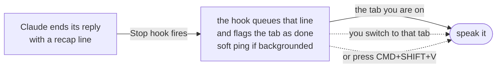

# aloud

A small collection of local, work-safe tools for people who'd rather **listen
than read** — less eye strain, fewer walls of text to get through in a day.
Everything runs on your machine (no cloud, no accounts, no IP concerns), sharing
one local [Kokoro](https://github.com/thewh1teagle/kokoro-onnx) neural voice.

## The tools

| Tool | What it does | Start here |
|------|--------------|-----------|
| **claude-voice** | Claude Code talks back a short spoken recap each turn instead of you reading walls of terminal output; tabs flag when they need you. | [claude-voice](#claude-voice) |
| **PDF reader** | Read-along for PDFs: the page on one side, a voice reading it on the other — select-to-read, follow-highlight, transport controls. The **Spit It Out** desktop app. | [Read a PDF aloud](#read-a-pdf-aloud) |

Each tool is its own top-level directory (`hooks/`+`lib/` for claude-voice,
`pdf-reader/` for the reader); the shared TTS engine lives in `kokoro/`. A future
tool is a new directory that reuses the same engine and `~/.claude/voice/kokoro`
runtime.

## claude-voice

Talk to Claude Code, and have it talk back — without a hot mic and without
reading walls of text. Local, work-safe, and quiet when you need it to be.

- **You speak** with Claude Code's built-in `/voice` (push-to-talk).
- **Claude speaks back** a short spoken recap per turn (a sentence, or a few). Never code, paths, or diffs.
- **Many panes at once?** Tabs flag a colored glyph when they need you (done,
  waiting, or errored) and the status bar counts how many do. One key jumps to
  the most urgent and reads it. Only the pane you're looking at talks.
- **In a meeting?** One toggle silences everything. Tabs still flag quietly.

## Built for WezTerm (read this first)

I built this for myself, and I run [WezTerm](https://wezfurlong.org/wezterm/).
Split it in two before you decide if it's for you:

- **Voice in and out works on any terminal.** The Claude Code hooks + `/voice`
  dictation + local TTS have no terminal dependency. If all you want is spoken
  recaps instead of reading walls of text, you're done after `install.sh`.
- **The multi-pane niceties live in my WezTerm config.** Specifically: the
  per-tab status glyphs (✓ / ⏸ / ✗), the status-bar count of panes needing you,
  jump-to-the-most-urgent-pane, speak-on-return, and the `CMD+…` keybindings.
  These are drawn by WezTerm polling the state files the hooks write.

Want those niceties on a different terminal? You'll need one you can script
(tmux, kitty, …). The hooks already write the state (the stable contract), so
it's a wiring job, not a rewrite: read the same state files and render the
glyphs/badge, and bind a key to `voice stop` and `voice drain`. The pieces and the
contract are in [Portable by design](#portable-by-design) below — enough for you
(or an agent) to adapt it to your setup. Stock macOS Terminal.app can't script
per-tab glyphs, so there you get the voice half only.

## How it works



The spoken recap is written by Claude itself (a rule in `CLAUDE.md` tells it
to end every reply with a `🔊` line). The hook speaks only that line, so
code is never read aloud — nothing to strip, nothing to summarize.

For the full picture (every hook, the state files, and how WezTerm reads them),
see [`docs/architecture.md`](docs/architecture.md).

## Two modes

| Mode | When | Focused pane finishes | Background pane finishes |
|------|------|-----------------------|--------------------------|
| **auto** | heads-down | speaks right away | tab flag + soft ping, speaks when you return |
| **wait** | meetings / DND | silent | tab flag only, **no sound**; speaks when you ask |

Toggle with **CMD+CTRL+V** (or `bin/voice toggle`). Entering *wait* makes only a
quiet blip, safe mid-call.

`voice autospeak off` is a separate, persistent setting: summaries stop
*auto*-playing (you pull them with the keys) but you still get pings. Flip it off
right before you dictate so it won't talk over you; wait mode silences everything.

## States at a glance

Each **inactive** tab shows one colored glyph (the active tab you can already see):

| Glyph | Color | State | Needs you |
|-------|-------|-------|-----------|
| (none) | — | working | no — stays plain so it recedes |
| ✓ | green | done | review / next |
| ⏸ | amber | waiting on input | yes |
| ✗ | red | error | yes, now |

A `✓` clears once you switch to a tab (seen); a `⏸` clears when Claude resumes work (you approved the prompt) or the turn ends. The status bar aggregates only what needs an action, e.g. `✗1 ⏸2`, so a non-empty badge always means "act now" — and it counts only live panes, so a closed session can't leave a phantom in the count.

## Keys

The `CMD+…` shortcuts are WezTerm bindings; on another terminal run the same
actions as `voice <command>` (see `voice help`) or bind them yourself.

| Key | Does |
|-----|------|
| **CMD+SHIFT+V** | speak this pane's queued recap now |
| **CMD+SHIFT+R** | replay the last summary from the start (cuts current playback; no old audio continues) |
| **CMD+SHIFT+J** | jump to the most urgent pane and speak its recap |
| **CMD+.** | interrupt speech (barge-in) — talk over Claude |
| **CMD+CTRL+V** | toggle auto ⇄ wait |
| **CMD+SHIFT+/** | quick key/command reference (`voice help` for the full list) |
| `/voice` (in Claude Code) | push-to-talk dictation |

## Install (macOS)

```bash
git clone <this repo> ~/claude-voice
~/claude-voice/install.sh      # backs up, then wires hooks + CLAUDE.md
```

Then, if you use WezTerm, apply `wezterm/INTEGRATE.md` to your `wezterm.lua` (`~/.wezterm.lua` or `~/.config/wezterm/wezterm.lua`)
(tab glyphs + speak-on-return). Start a **new** Claude Code session so the hooks
load. That's it.

Needs `jq` and a TTS backend: macOS ships `say`; on Linux install `spd-say`
(speech-dispatcher) or `espeak-ng`. (`brew install jq` / `apt install jq`.)

Put the `voice` command on your PATH so it works from any directory:

```bash
echo 'export PATH="$HOME/claude-voice/bin:$PATH"' >> ~/.zshrc   # or ~/.bashrc
```

## Try it (30 seconds)

In a Claude Code pane:

1. Run `/voice` once to enable push-to-talk dictation.
2. Ask Claude anything. When it finishes, you hear **a short spoken recap** — never the code.
3. Open a second tab, start something there, switch away. When it finishes, that tab
   shows **✓** and pings. Switch back and it speaks. That's the async loop.
4. Heading into a meeting? **CMD+CTRL+V** silences everything (tabs still flag quietly). Toggle back after.

## Is it safe for work?

Yes. Nothing proprietary leaves your Mac.

- **Output** is synthesized locally — macOS `say` or the Kokoro neural voice,
  both fully offline. Your code, diffs, and the spoken recap never leave the Mac.
- **Input** (`/voice`) sends *audio of your voice* to Anthropic's speech service
  only — the same vendor already handling your Claude sessions. No third party.
- Prefer zero audio off-device? Swap `/voice` for a local STT (whisper.cpp) — the
  output side is unchanged.

## A human voice (not robotic)

The default is macOS `say` — zero install, but robotic. For a natural neural
voice that's still 100% offline:

```bash
./setup-kokoro.sh                       # isolated uv venv + ~360MB model, one time
# then in ~/.claude/voice/config.sh:
#   VOICE_TTS=kokoro
```

[Kokoro](https://github.com/thewh1teagle/kokoro-onnx) runs locally (Apple Silicon,
and Linux/Windows via sounddevice). A warm daemon keeps the model loaded and speaks sentence-by-sentence, so
audio starts in about a second instead of after the whole summary synthesizes.
Audition every Kokoro voice with **`voice voices`** — **space** next, **p** back, **q**
quit — or narrow to a group (`voice voices af` / `am` / `bf` / `bm`). Lock one in
with **`voice use bf_emma`**. If Kokoro isn't set up, it falls back to `say`.

## Read a PDF aloud

Point the same Kokoro voice at a PDF and read along, 100% offline (nothing leaves
the machine, so work/NDA documents are fine):

```bash
pdf-read ~/Downloads/paper.pdf          # whole document
pdf-read ~/Downloads/paper.pdf 3-40     # pages 3–40 (skip cover, TOC, references)
```

No terminal, no filename: run **`./setup-app.sh`** once to build the **Spit It Out**
app, drag it to your Dock, then **drop a PDF on it** — or right-click any PDF ▸
**Open With ▸ Spit It Out**. (Launched on its own — Dock or Spotlight — it opens
a file picker.) The `pdf-read` command above is the same thing from a terminal.

A **split view** opens in your browser: the rendered PDF on one side, the reader on
the other. **Select any text on the PDF and the voice reads from there**; the
sentence being spoken highlights on the page and follows along. Controls: play/pause,
skip back/forward, stop, slower/faster — plus **Space**, **←**, **→** keys.
Skip-forward blows past junk without waiting. Also in the UI: a **voice picker**
(50+ Kokoro voices grouped by accent and gender), **per-pane zoom** (PDF and reader
text), a **Float** button that pops the controls into an always-on-top mini window
(Document Picture-in-Picture) so you can drive it while reading elsewhere, and a top
bar to resize / collapse / stack the panes (drag the divider; your layout is
remembered). Headers, footers, and page numbers are dropped from what's read (by
page position, so it survives odd layouts); a page range skips whole sections.

Control it from anywhere with **`pdf-ctl play|pause|next|prev|stop|speed 1.2`** (bind
those to global hotkeys via [RECIPES.md](RECIPES.md) to drive it while another window
is focused). Needs `./setup-kokoro.sh`. The PDF is rendered by
[PDF.js](https://github.com/mozilla/pdf.js) (Apache-2.0), vendored under
`pdf-reader/weblib/` and served from `127.0.0.1` (Host-checked), so it stays 100%
offline. Scanned image PDFs have no text to extract and aren't supported (no OCR).

## Barge-in

Speech stops automatically when you **send a prompt** or **switch to another pane**
(you left that conversation). `voice stop` cuts it on demand — `CMD+.` in WezTerm,
or bind it for any terminal / a global hotkey via [RECIPES.md](RECIPES.md).

## Portable by design

The core is OS- and terminal-agnostic: Claude Code hooks write **state files** (the
stable contract), and audio goes through a detected backend you can override.

- **Audio** auto-detects speech (`say` → `spd-say` → `espeak-ng` → `espeak`) and sound
  (`afplay` → `paplay` → `pw-play` → `aplay` → `ffplay` → `play`); force either with
  `VOICE_SPEAK_CMD` / `VOICE_PLAY_CMD`.
  Kokoro plays cross-platform via `sounddevice`.
- **Interrupt** is a plain `voice stop`; the key that triggers it (per-terminal or an
  OS-global hotkey) is a recipe in [RECIPES.md](RECIPES.md), not hardcoded.
- **Terminals**: WezTerm draws the glyphs/badge today; any terminal can read the same
  state files — tmux/kitty are an adapter recipe away.
- A missing backend degrades gracefully: warns once, the hook still exits 0, glyphs
  still work.

## Troubleshooting

| Symptom | Fix |
|---------|-----|
| Nothing spoken | `bin/voice status`; make sure the reply ended with a 🔊 line; confirm hooks loaded (new session if needed). |
| No glyph on background tabs | WezTerm didn't get the edits — apply `wezterm/INTEGRATE.md` and reload the config. |
| Voice still robotic | You're on `say`. Run `./setup-kokoro.sh`, then set `VOICE_TTS=kokoro`. |
| Speaks from the wrong pane | Launch Claude Code inside WezTerm so `$WEZTERM_PANE` reaches the hooks. |
| Speech won't stop | Send a prompt (barge-in) or run `voice stop`. |
| Repeated last word, clicks at sentence breaks, or truncated/stuck neural playback | The deployed Kokoro daemon under `~/.claude/voice/kokoro/` is likely stale — a daemon fix can ship in the repo without being installed. Re-run `./setup-kokoro.sh` (redeploys `daemon.py`), then restart the daemon: `pkill -f kokoro/daemon.py` (it auto-respawns on the next spoken line, no state to replay). |
| Summary spoken as a bare "Done." | The reply omitted its 🔊 line; the Stop hook now re-prompts once and otherwise speaks the message tail. If it persists, confirm `hooks/on-stop.sh` is the installed version. |

## Configuration

All overrides live in `~/.claude/voice/config.sh` (copy of `config/config.sample.sh`):

| Var | What |
|-----|------|
| `VOICE_TTS` | `say` (built-in) or `kokoro` (neural) |
| `VOICE_KOKORO_VOICE` | Kokoro voice — `voice voices` to audition, `voice use <v>` to set |
| `VOICE_ENFORCE_MARKER` | `true` (default): a reply missing its 🔊 line is blocked once so it's re-sent with one; `false`: skip the nudge and just speak the message tail |
| `VOICE_KOKORO_SPEED` | speaking speed, 1.0 = normal — or `voice speed 1.2` |
| `VOICE_AUTO_SPEAK` | `true` (speak on switch/finish) or `false` (silent; `voice autospeak off`) |
| `VOICE_PANE_VOICES` | `true` gives each pane its own Kokoro voice, so you can tell concurrent sessions apart by ear (default off) |
| `VOICE_SAY_VOICE` / `VOICE_SAY_RATE` | macOS `say` voice + words/min |
| `VOICE_SPEAK_CMD` / `VOICE_PLAY_CMD` | force the audio backend (Linux/Windows) |
| `VOICE_SOUND_*` | cue sounds (path, or `""` to silence one) |

## Files

| Path | What |
|------|------|
| `hooks/on-stop.sh` | speak or queue the 🔊 line when a turn ends |
| `hooks/on-notification.sh` | cue / flag when Claude needs input |
| `hooks/on-prompt.sh` | flag "working", record the task; barge-in on send |
| `hooks/on-active.sh` | flag "working" on each tool run (clears a stale ⏸ when work resumes) |
| `hooks/on-stopfailure.sh` | flag "error" when a turn fails |
| `hooks/on-session.sh` | clear a pane's files on start/end (no stale glyphs) |
| `bin/voice` | the CLI — run `voice help` for keys + commands (`voices`, `use`, `speed`, `autospeak`, …) |
| `lib/voice-lib.sh` | state files, focus logic, the `voice` helpers |
| `kokoro/` | shared TTS engine — the neural-voice daemon and voice auditioner |
| `bin/kokoro-say` + `setup-kokoro.sh` | local neural voice (warm daemon), shared by all tools |
| `bin/pdf-read` + `bin/pdf-ctl` | Spit It Out: read a PDF aloud (split view) + transport CLI |
| `pdf-reader/reader.py` + `pdf-reader/pdf_extract.py` | the reader daemon and PDF text extractor |
| `pdf-reader/weblib/` | split-view reader UI + vendored PDF.js (Apache-2.0) |
| `setup-app.sh` + `mac/icon.png` | build the drag-and-drop "Spit It Out" app (no terminal) |
| `lib/voice-audio.sh` | portable speak/play/stop, detected + overridable |
| `config/config.sample.sh` | voice, rate, backend, and cue-sound overrides |
| `RECIPES.md` | bind `voice stop` per-terminal or as an OS-global hotkey |
| `test/test-audio.sh` | portability self-check (fake backend, no speaker needed) |
| `wezterm/INTEGRATE.md` | 4 edits for an existing `wezterm.lua` |
| `wezterm/voice.lua` | drop-in module for a fresh `wezterm.lua` |
| `config/CLAUDE.snippet.md` | the 🔊 rule the installer appends |

See [`docs/architecture.md`](docs/architecture.md) for the full event/state map.

## License

MIT — see [LICENSE](LICENSE).
