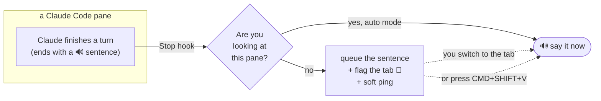

# claude-voice

Talk to Claude Code, and have it talk back — without a hot mic and without
reading walls of text. Local, work-safe, and quiet when you need it to be.

- **You speak** with Claude Code's built-in `/voice` (push-to-talk).
- **Claude speaks back** one plain sentence per turn. Never code, paths, or diffs.
- **Many panes at once?** Every tab shows a colored state glyph (working, done,
  needs-you, error) and the status bar counts how many need you. One key jumps
  to the most urgent and speaks it. Only the pane you're looking at talks.
- **In a meeting?** One toggle silences everything. Tabs still flag quietly.

## How it works



The spoken sentence is written by Claude itself (a rule in `CLAUDE.md` tells it
to end every reply with a `🔊` one-liner). The hook speaks only that line, so
code is never read aloud — nothing to strip, nothing to summarize.

## Two modes

| Mode | When | Focused pane finishes | Background pane finishes |
|------|------|-----------------------|--------------------------|
| **auto** | heads-down | speaks right away | tab flag + soft ping, speaks when you return |
| **wait** | meetings / DND | silent | tab flag only, **no sound**; speaks when you ask |

Toggle with **CMD+CTRL+V** (or `bin/voice toggle`). Entering *wait* makes only a
quiet blip, safe mid-call.

## States at a glance

Each **inactive** tab shows one colored glyph (the active tab you can already see):

| Glyph | Color | State | Needs you |
|-------|-------|-------|-----------|
| (none) | — | working | no — stays plain so it recedes |
| ✓ | green | done | review / next |
| ⏸ | amber | waiting on input | yes |
| ✗ | red | error | yes, now |

A `✓` clears from a tab once you switch to it (seen). The status bar aggregates only what needs an action, e.g. `✗1 ⏸2`, so a non-empty badge always means "act now."

## Keys

| Key | Does |
|-----|------|
| **CMD+SHIFT+V** | speak this pane's queued sentence now |
| **CMD+SHIFT+R** | recap what this tab is doing (task + state) |
| **CMD+SHIFT+J** | jump to the most urgent pane and speak its recap |
| **CMD+.** | interrupt speech (barge-in) — talk over Claude |
| **CMD+CTRL+V** | toggle auto ⇄ wait |
| `/voice` (in Claude Code) | push-to-talk dictation |

## Install (macOS)

```bash
git clone <this repo> ~/Desktop/personal/claude-voice
~/Desktop/personal/claude-voice/install.sh      # backs up, then wires hooks + CLAUDE.md
```

Then, if you use WezTerm, apply `wezterm/INTEGRATE.md` to your `~/.wezterm.lua`
(tab glyphs + speak-on-return). Start a **new** Claude Code session so the hooks
load. That's it.

Needs `jq` and macOS `say` (both standard/`brew install jq`).

## Try it (30 seconds)

In a Claude Code pane:

1. Run `/voice` once to enable push-to-talk dictation.
2. Ask Claude anything. When it finishes, you hear **one spoken sentence** — never the code.
3. Open a second tab, start something there, switch away. When it finishes, that tab
   shows **🔔** and pings. Switch back and it speaks. That's the async loop.
4. Heading into a meeting? **CMD+CTRL+V** silences everything (tabs still flag quietly). Toggle back after.

## Is it safe for work?

Yes. Nothing proprietary leaves your Mac.

- **Output** is synthesized locally — macOS `say` or the Kokoro neural voice,
  both fully offline. Your code, diffs, and the spoken sentence never leave the Mac.
- **Input** (`/voice`) sends *audio of your voice* to Anthropic's speech service
  only — the same vendor already handling your Claude sessions. No third party.
- Prefer zero audio off-device? Swap `/voice` for a local STT (whisper.cpp) — the
  output side is unchanged.

## A human voice (not robotic)

The default is macOS `say` — zero install, but robotic. For a natural neural
voice that's still 100% offline:

```bash
./setup-kokoro.sh                       # isolated uv venv + ~360MB model, one time
# then in ~/.claude/voice/config.sh:
#   VOICE_TTS=kokoro
```

[Kokoro](https://github.com/thewh1teagle/kokoro-onnx) runs locally on Apple
Silicon. A warm daemon keeps the model loaded and speaks sentence-by-sentence, so
audio starts in about a second instead of after the whole summary synthesizes.
Pick a voice with `VOICE_KOKORO_VOICE` (`af_heart`, `am_adam`, `bf_emma`, …). If
Kokoro isn't set up, it falls back to `say`.

## Barge-in

Sending a prompt (typed or dictated) stops any speech in progress — start your
next instruction and Claude stops talking. `voice stop` cuts speech on demand.

## Portable vs. WezTerm

- **Core** (any terminal): hooks + `say` + modes + queue. Works with no WezTerm;
  "which pane finished" falls back to a ping.
- **WezTerm layer** (opt-in): the tab glyph and speak-on-return.

## Troubleshooting

| Symptom | Fix |
|---------|-----|
| Nothing spoken | `bin/voice status`; make sure the reply ended with a 🔊 line; confirm hooks loaded (new session if needed). |
| No 🔔 on background tabs | WezTerm didn't get the edits — apply `wezterm/INTEGRATE.md` and reload the config. |
| Voice still robotic | You're on `say`. Run `./setup-kokoro.sh`, then set `VOICE_TTS=kokoro`. |
| Speaks from the wrong pane | Launch Claude Code inside WezTerm so `$WEZTERM_PANE` reaches the hooks. |
| Speech won't stop | Send a prompt (barge-in) or run `voice stop`. |

## Files

| Path | What |
|------|------|
| `hooks/on-stop.sh` | speak or queue the 🔊 line when a turn ends |
| `hooks/on-notification.sh` | cue / flag when Claude needs input |
| `hooks/on-prompt.sh` | flag "working", record the task; barge-in on send |
| `hooks/on-stopfailure.sh` | flag "error" when a turn fails |
| `hooks/on-session.sh` | clear a pane's files on start/end (no stale glyphs) |
| `bin/voice` | `auto`/`wait`/`toggle`/`status`/`stop`/`drain`/`recap`/`jump`/`attention` |
| `bin/kokoro-say` + `setup-kokoro.sh` | optional local neural voice |
| `config/config.sample.sh` | voice, rate, backend, and cue-sound overrides |
| `wezterm/INTEGRATE.md` | 4 edits for an existing `wezterm.lua` |
| `wezterm/voice.lua` | drop-in module for a fresh `wezterm.lua` |
| `config/CLAUDE.snippet.md` | the 🔊 rule the installer appends |

See `docs/architecture.md` for the full event/state map.
