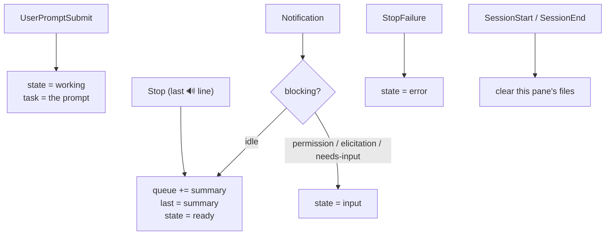
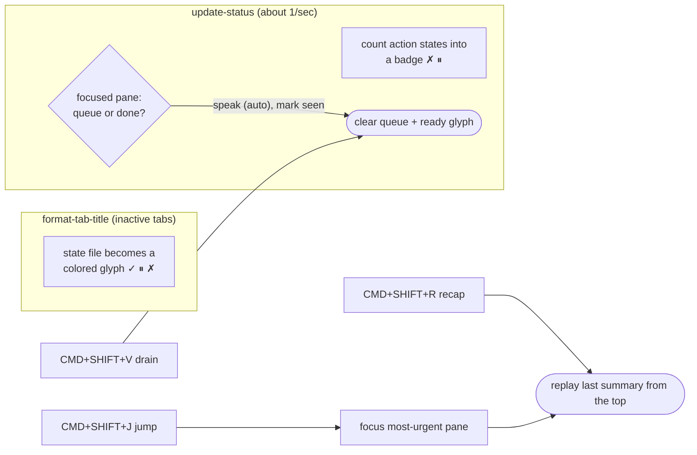

# Architecture

Everything is coordinated through small files under `~/.claude/voice/`. Claude
Code hooks run **without a controlling terminal**, so they can't set OSC user
vars the way `statusline.sh` does — but they can write files, and WezTerm's Lua
reads them each render.

```
~/.claude/voice/
  mode              auto | wait                        (global; one toggle)
  state/<pane_id>   working | ready | input | error    (tab glyph + badge)
  queue/<pane_id>   the 🔊 sentence waiting to be spoken for that pane
  task/<pane_id>    short name of what the session is doing (from the prompt)
  last/<pane_id>    last spoken summary, kept for on-demand recap
```

Files are written atomically (temp + rename) so a WezTerm reader never sees a
torn or empty file. WezTerm reuses a `pane_id` after a pane closes, so
`SessionStart`/`SessionEnd` wipe a pane's files — otherwise a reused id could show
a stale glyph or speak a dead session's summary.

## Events → state



## WezTerm reads that state



## Who decides "speak vs. queue"

Every finish just queues the summary and flags the tab. WezTerm's `update-status`
poll, guarded by `window:is_focused()`, speaks the focused pane's queue within
~1s. The decision lives on the WezTerm side because only it reliably knows which
pane is front-most: a hook can lose `$WEZTERM_PANE` under tmux/ssh and cannot
disambiguate multiple windows. Switching panes runs `voice switched`, which stops
the pane you left before speaking the new one. `VOICE_AUTO_SPEAK=false` disables
all auto-speak, so nothing plays until you press a key.

## Triage across many sessions

The badge counts only what needs an action (`error`, `input`) **on live panes**
(orphaned state files are pruned), so a non-empty badge always means "act now". A
`ready` `✓` clears the moment you focus the tab; an `input` `⏸` clears when Claude
resumes work — a `PreToolUse` hook sets `working` on each tool run, so approving a
permission flips the tab out of "needs you" as soon as the next tool executes. `CMD+SHIFT+J`
(`voice jump`) focuses the highest-severity pane and reads it; `CMD+SHIFT+R`
(`voice recap`) replays the last summary from the top, cutting any current playback.

## Speech

Audio goes through a detected backend (`lib/voice-audio.sh`) — `voice_speak` /
`voice_play` / `voice_stop`, resolved from PATH (`say`→`spd-say`→`espeak-ng`,
`afplay`→`paplay`→`aplay`) and overridable via `VOICE_SPEAK_CMD` /
`VOICE_PLAY_CMD`. Kokoro runs as a warm daemon (`kokoro/daemon.py`, a unix socket)
that loads the model once and, on a worker thread, synthesizes the next sentence
while the current one plays (via cross-platform `sounddevice`) — gapless. `voice
stop` touches an interrupt file the daemon checks between and within sentences, so
barge-in cuts a summary mid-way.

## Portability

The state files are the portable contract; WezTerm is one adapter (tmux/kitty can
read the same files). Audio is a detected, overridable backend, so no macOS command
is hardcoded in the hot path. With no `$WEZTERM_PANE` and no WezTerm everything still
speaks; a missing audio backend warns once and no-ops (the hook still exits 0); only
`jq` is required. The interrupt is `voice stop` plus per-environment binding recipes
(`RECIPES.md`), never a hardcoded terminal dependency.
