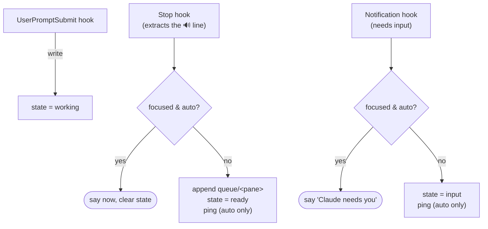
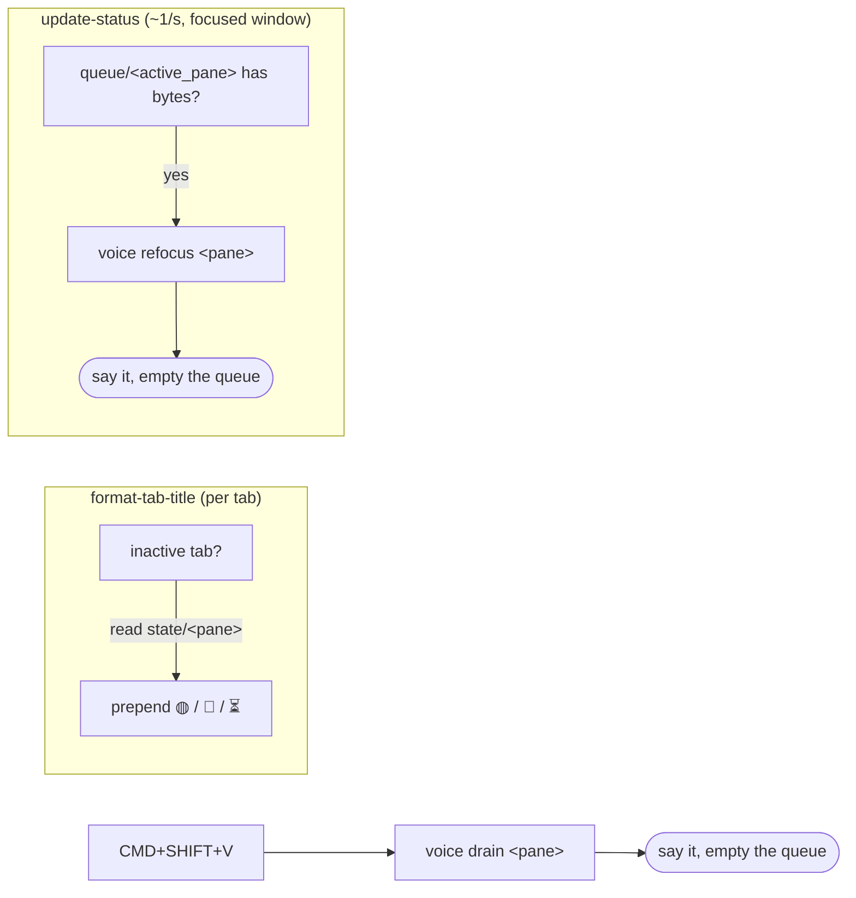

# Architecture

Everything is coordinated through small files under `~/.claude/voice/`, because
Claude Code hooks run **without a controlling terminal** — they can't emit the
OSC user-var escape that `statusline.sh` uses, but they can write files, and
WezTerm's Lua can read them.

```
~/.claude/voice/
  mode              auto | wait          (global; one toggle)
  queue/<pane_id>   the 🔊 sentence(s) waiting to be spoken for that pane
  state/<pane_id>   working | ready | input   (drives the tab glyph)
```

## Events → state



## WezTerm reads that state



## Why focus is decided in the hook, not WezTerm

The Stop hook knows its own pane via `$WEZTERM_PANE`, and asks
`wezterm cli list-clients` for `focused_pane_id`. Equal → you're looking at it →
speak. That keeps the "speak vs. queue" decision in one place, and the WezTerm
side only has to render state and drain on return.

Glyphs self-clear: `format-tab-title` shows the glyph **only on inactive tabs**,
so focusing a tab hides it immediately; `refocus`/`drain` then delete the state
and queue files.

## Portability

The hooks degrade cleanly. With no `$WEZTERM_PANE` (not under WezTerm),
`voice_is_focused` returns true, so a single-terminal user just hears every
summary — no glyphs, no focus logic, still no code read aloud.
