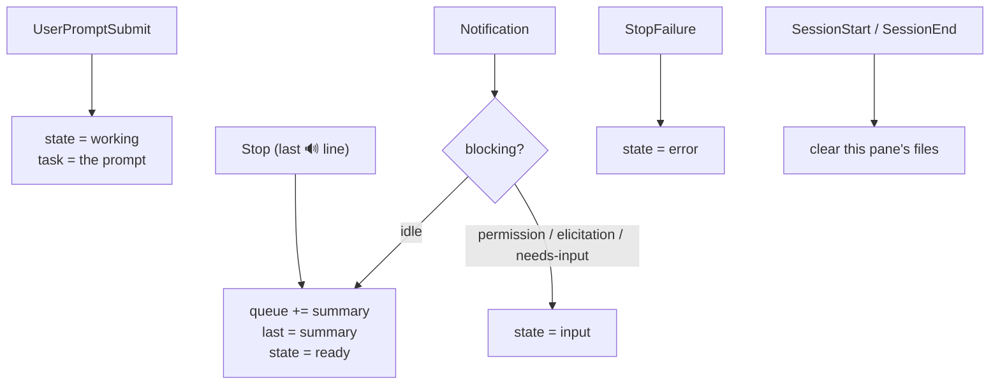
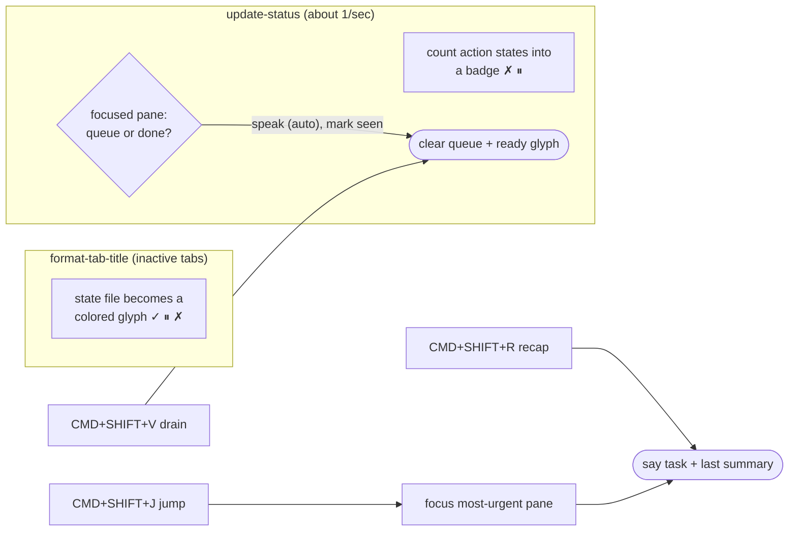

# Architecture

Everything is coordinated through small files under `~/.claude/voice/`. Claude
Code hooks run **without a controlling terminal**, so they can't set OSC user
vars the way `statusline.sh` does — but they can write files, and WezTerm's Lua
reads them each render.

```
~/.claude/voice/
  mode              auto | wait                        (global; one toggle)
  state/<pane_id>   working | ready | input | error    (tab glyph + badge)
  queue/<pane_id>   the 🔊 sentence waiting to be spoken for that pane
  task/<pane_id>    short name of what the session is doing (from the prompt)
  last/<pane_id>    last spoken summary, kept for on-demand recap
```

Files are written atomically (temp + rename) so a WezTerm reader never sees a
torn or empty file. WezTerm reuses a `pane_id` after a pane closes, so
`SessionStart`/`SessionEnd` wipe a pane's files — otherwise a reused id could show
a stale glyph or speak a dead session's summary.

## Events → state



## WezTerm reads that state



## Who decides "speak vs. queue"

Every finish just queues the summary and flags the tab. WezTerm's `update-status`
poll, guarded by `window:is_focused()`, speaks the focused pane's queue within
~1s. The decision lives on the WezTerm side because only it reliably knows which
pane is front-most: a hook can lose `$WEZTERM_PANE` under tmux/ssh and cannot
disambiguate multiple windows.

## Triage across many sessions

The badge counts only what needs an action (`error`, `input`), so a non-empty
badge always means "act now". A `ready` (done) tab shows a `✓` that clears the
moment you focus it — so `✓` means "done and not yet seen". `CMD+SHIFT+J`
(`voice jump`) focuses the highest-severity pane and speaks its recap; `CMD+SHIFT+R`
(`voice recap`) answers "what is this tab doing" from its `task` and `last` files.

## Speech

`say` speaks synchronously. Kokoro runs as a warm daemon (`kokoro/daemon.py`, a
unix socket) that loads the model once and plays **sentence by sentence**, so
audio starts after the first short sentence rather than after the whole summary.
`CMD+.` (`voice stop`) touches an interrupt file the daemon checks between
sentences, so barge-in cuts a summary mid-way.

## Portability

The hooks degrade cleanly. With no `$WEZTERM_PANE` and no WezTerm, everything
still speaks (no glyphs, no focus logic). Missing `say` / `afplay` / Kokoro just
no-op; only `jq` is required, and its absence is reported once.
